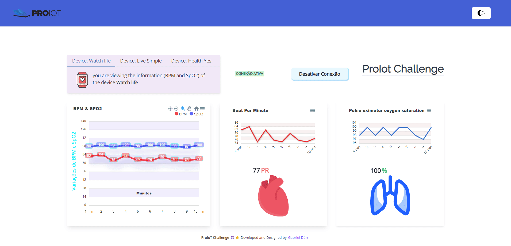
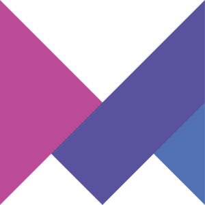
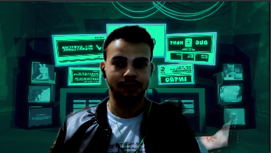

<h1 align="center">ProIot Challenge</h1>

   

           

 

        <a href="#challenge">challenge</a> |
        <a href="#built_with">built with</a> |
        <a href="#author">author</a> |
        <a href="#links">Links</a> |
        <a href="#license">license</a> 

   

<h1 id="challenge"  align="center">⚡ O Desafio </h1>

>  

   

Essa aplicação simula equipamentos LoraWan, voltadas ao monitoramento de sinais vitais em real time dos usuários. Essa é só uma das inúmeras possibilidades da IoT ⚡.

Este repositório contém dois projetos, <b>Client</b> front-end e <b>Server</b> api back-end <b>WebSockets</b>. No client criei um gerenciador de estado com context API, e um hook personalizado que pode ser utilizado em toda aplicação, contendo os seguintes dados:

 

-   <b>isConnected</b> : Estado que contem um <b>Boolean</b> que diz se a aplicação esta conectada com serviço websocket ou não.
-   <b>nameCharts</b> : Objeto no qual as props contém o nome dos tipos de dados que serão plotados nos gráficos.
-   <b>watchlifeDevice</b>, <b>livesimpleDevice</b>, <b>healthyesDevice</b> : Estados com a estrutura de três dispositivos já prontas da API, que são atualizadas a cada 10 segundos.
-   <b>idSocket</b> : Contém o ID do socket conectado.
-   <b>error</b> : Caso tenha algum erro, conseguimos visualizar através dessa variável.

   

Através desses dados, criei as funcionalidades, animações.., do <b>Dashboard</b>.

  

<h2 id="built_with"> 🧙‍♂️ Built with</h2>

 

        

         

> <h2> Instalando o Projeto </h2>

   

   <h4> Faça o clone do projeto e instale as dependências do Client e Server individualmente, ou basta executar os códigos abaixo: </h4>

   

1- Ira realizar o clone e instalar as dependências do <b>Server</b> :

   

    clone https://github.com/gabriel-durr/proiot-challenge.git && cd proiot-challenge/server && yarn

  

2- Após finalizar. Insira essa nova linha para instalar as dependências do Client:

    cd .. && cd client && yarn

   

3- Inicie o Projeto Client e Server:

<b>Client</b>

    yarn start

 

<b>Server</b>

    yarn dev

       

<h2 id="links">Links 🔗</h2>

  

ApexCharts é uma biblioteca de gráficos moderna que ajuda... [Learn More](https://apexcharts.com/react-chart-demos/ "Clique para ser redirecionado!").

Socket.IO é uma biblioteca que permite baixa-latência, bidirecional e baseado em eventos de comunicação entre cliente e um servidor... [Learn More](https://socket.io/pt-br/docs/v4/ "Clique para ser redirecionado!")

     

<h5 id = "author" align="center"></h5>

<table align="center">
  <tr>
      <td>
      <a href="https://github.com/gabriel-durr">
         
      </a>
      </td>
  </tr>
</table>

        <b><em>Made with 💜&ensp; by Gabriel Dürr </em></b>

     

        
<h3 id="license" ></h3>

> This project is licensed under the &nbsp; 

