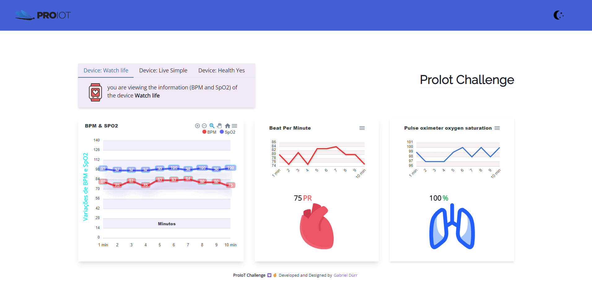

<h1 align="center" class="line-1 anim-typewriter">ProIot Challenge</h1>

<div align="center">
         
        
</div>

<br/>

<div align="center"  class="links">
        <a href="#challenge">challenge</a> |
        <a href="#built_with">built with</a> |
        <a href="#author">author</a> |
        <a href="#license">license</a> 
</div>

<br/>
<br/>

<h2 id="challenge"  align="center">⚡ The challenge </h2>

<div align="center">
        <p>  </p>
</div>

<br/><br/>

> <h3> Links : </h3>

ApexCharts ... [Learn More](https://apexcharts.com/react-chart-demos/ "Clique para ser redirecionado!").

Socket.IO é uma biblioteca que permite baixa-latência, bidirecional e baseado em eventos de comunicação entre cliente e um servidor... [Learn More](https://socket.io/pt-br/docs/v4/ "Clique para ser redirecionado!")

<br/><br/>

<h2 id="built_with"> 🧙‍♂️ Built with</h2>

<br>

<div align="center" class="container-icons">

<p float="left">


</p>
        
</div>

<br>

<br/>
<br/>
<br/>
<br/>

> <h3> Getting start : </h3>
> <br/>

<div>

1. <b>Clone the project</b>

```bash
  $ git clone URL DO PROJETO && cd NOME DA PASTA DO PROJETO
```

2. <b>Install dependencies</b>

```bash
  $ expo install
  $ yarn or npm i
```

3. <b>Start the application</b>

```bash
  $ expo start
  $ yarn dev or npm run dev
```

</div>

<br>

<h5 id = "author" align="center"></h5>

<table align="center">
  <tr>
      <td>
      <a href="https://github.com/gabriel-durr">
        <br>
      </a>
      </td>
  </tr>
</table>

<div align="center">
        <sub><b><em>Made with 💜&ensp; by Gabriel Dürr </em></b></sub>
</div>

<br/>
<br/>
<br/>

<h2></h2>

<div align="center">
        
<h3 id="license" ></h3>

> This project is licensed under the &nbsp; [](LICENSE)

</div>
